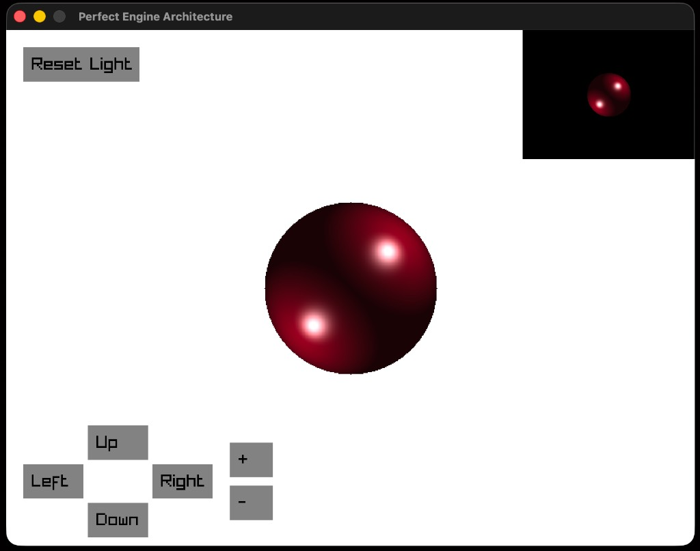

# SphereRendering

Программа на **C++** и **Raylib** для интерактивного рендеринга 3D-сфер с динамическим расчетом освещения и управлением через UI.



## Функционал
* **Два экрана (Pip):** Основное белое окно (800x600) и маленькое превью в углу на черном фоне (200x150).
* **Многоточечный свет:** Рендеринг объекта с учетом двух независимых источников света.
* **Кастомный UI:** Кнопки на экране обрабатывают клики мыши через лямбда-колбэки.

## Управление
* **Мышь (Интерфейс):** 
  * `Up`, `Down`, `Left`, `Right` — перемещение камеры.
  * `+` / `-` — изменение зума сцены.
  * `Reset Light` — сброс позиции источников света на дефолтную.
* **Клавиатура:**
  * `Cmd` + Стрелки — движение источника света по осям X и Y.
  * `Shift` + `Up` / `Down` — движение источника света по оси Z (глубина).

## Сборка на macOS
Для работы необходима установленная библиотека **Raylib** (`brew install raylib`).

Сборка проекта и запуск выполняются одной командой из корневой папки:
```bash
make run
```